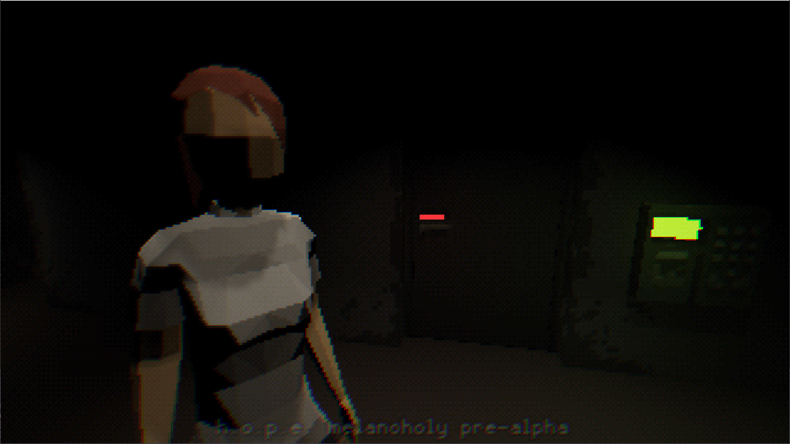
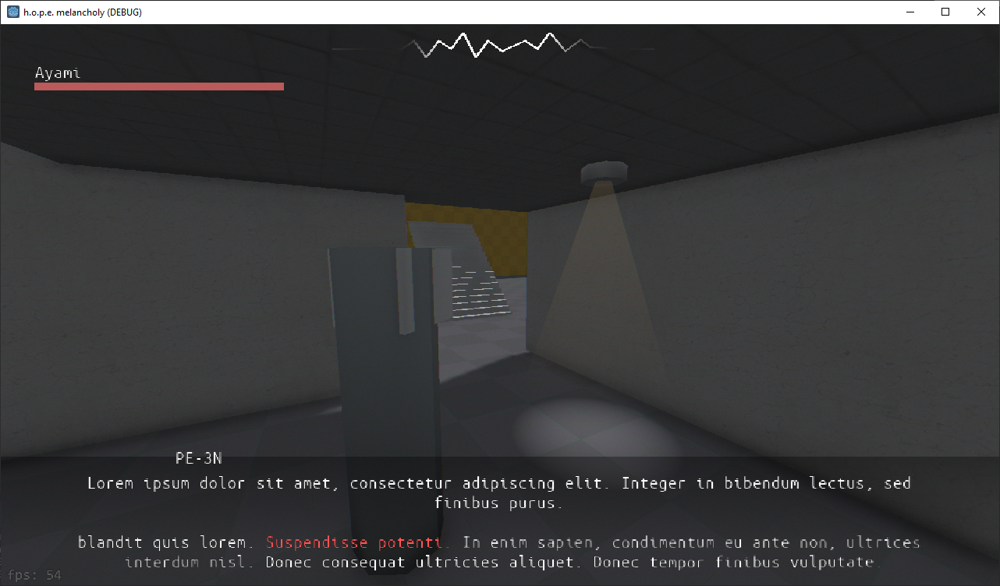

# Hope: Melancholy

This work is licensed under a <a rel="license" href="http://creativecommons.org/licenses/by-nc-nd/4.0/">Creative Commons Attribution-NonCommercial-NoDerivatives 4.0 International License (CC-BY-NC-ND)</a>.
________________

**Engine - Godot 3**

**Language - C#**

**Source Code - Available: Latest version**

**Executables - Multiple versions up to latest**

**Development Date - 2022**

________________

## Description
TPS version of https://github.com/artificial-studio/hope-melancholy-gms2

Second Godot project

## Screenshots
 
 

Later alternative version mockup

